<h1 align="center">🍀 행운복권 🍀</h1>

<p align="center">
  로또 6/45 · 연금복권 720+ 당첨 확인 앱<br/>
  <b>Kotlin Multiplatform + Compose Multiplatform</b>으로 Android와 iOS를 한 코드베이스에서 만듭니다.
</p>

<p align="center">
  
  
  
  
</p>

["행운복권"](https://github.com/junjange/lucky-lottery-android)은 개발자의 꿈을 갖고 처음으로 개발부터 배포까지 진행한 프로젝트입니다.
"행운복권v2"는 이를 Jetpack Compose로 마이그레이션하고 클린 아키텍처를 적용해 리팩터링했고,
지금은 한 걸음 더 나아가 **Kotlin Multiplatform으로 전환해 Android와 iOS를 같은 코드로 서비스**합니다.

전환 과정에서 앱의 성격도 다시 잡았습니다. 자체 서버와 로그인(카카오/구글)을 걷어내고
**로그인 없이 동작하는 로컬 우선(local-first) 앱**이 되었습니다. 당첨번호는 동행복권
공식 사이트에서 직접 받아오고, 내가 저장한 번호는 기기 안(Room)에만 남습니다.

## 주요 기능

- 로또 6/45 및 연금복권 720+의 회차별 당첨번호 조회
- QR코드 스캔을 통한 당첨 여부 즉시 확인
- OCR을 활용한 복권 용지 번호 자동 인식
- 내 번호 저장 및 자동 당첨 확인
- 랜덤 번호 생성
- 추첨일 로컬 알림

## 지원 플랫폼

| | 최소 버전 | 셸 | UI |
|---|---|---|---|
| Android | minSdk 24 (compileSdk 36) | 단일 `MainActivity` + Compose Navigation | Compose Multiplatform |
| iOS | iOS 17.0+ | SwiftUI `TabView` / `NavigationStack` | Compose Multiplatform 화면을 embed |

## 스크린샷

화면은 두 플랫폼이 같은 Compose 코드로 그리고, 탭 바처럼 셸이 그리는 부분만 OS를 따라갑니다.
(Android는 Material 3 `NavigationBar`, iOS는 SwiftUI `TabView`의 Liquid Glass)

### Android

| 홈 | 내 번호 · 로또 6/45 | 내 번호 · 연금복권 720+ |
|:---:|:---:|:---:|
| 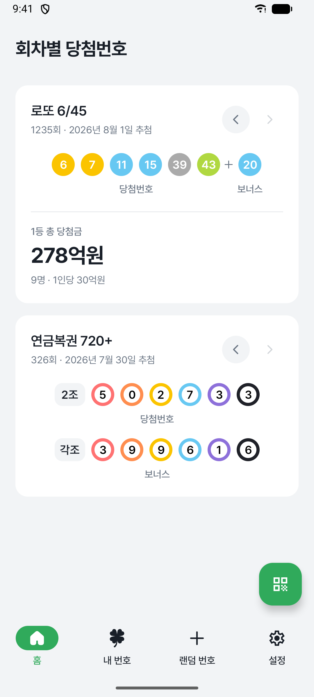 | 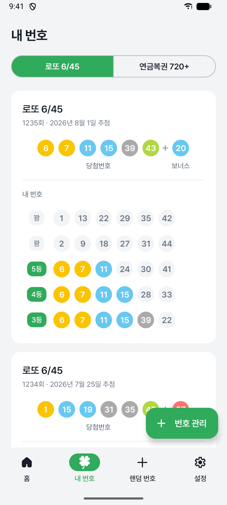 | 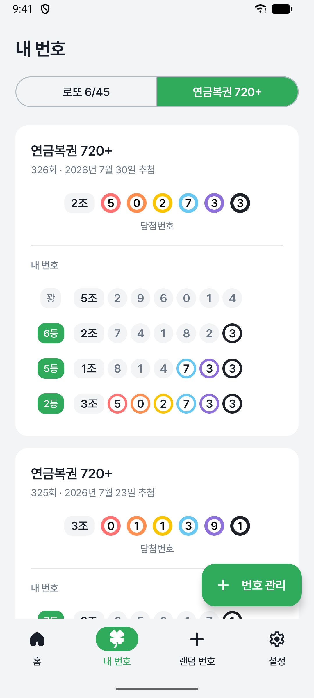 |

| 랜덤 번호 | 번호 생성 | 설정 |
|:---:|:---:|:---:|
| 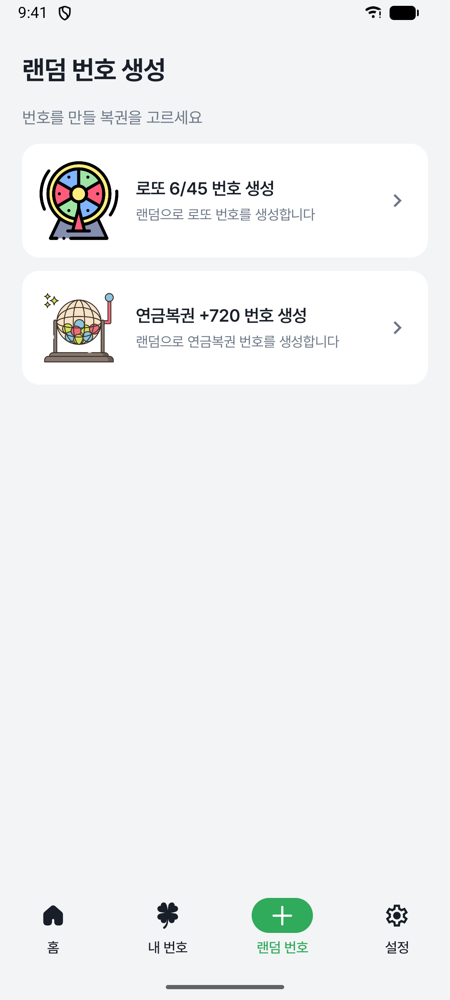 | 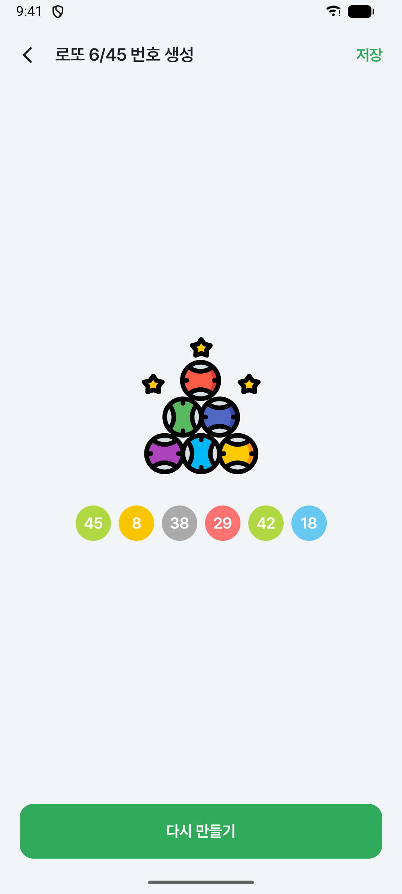 | 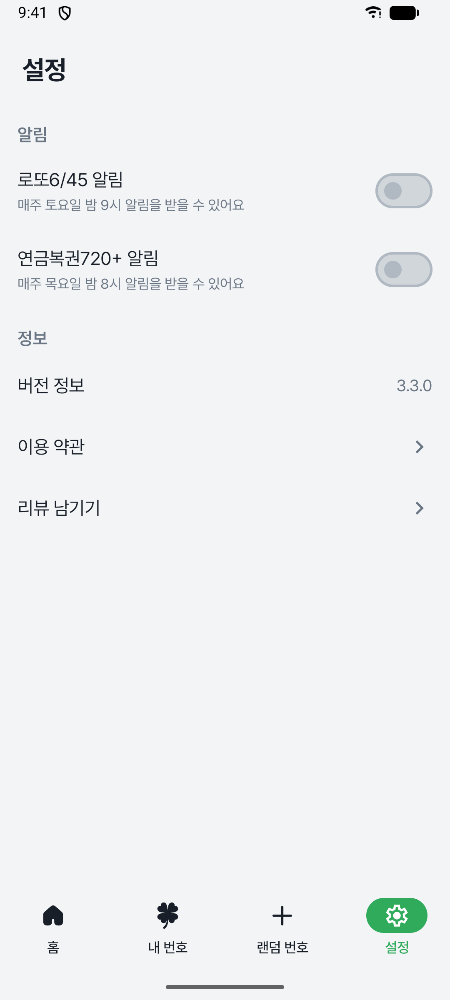 |

### iOS

| 홈 | 내 번호 · 로또 6/45 | 내 번호 · 연금복권 720+ |
|:---:|:---:|:---:|
| 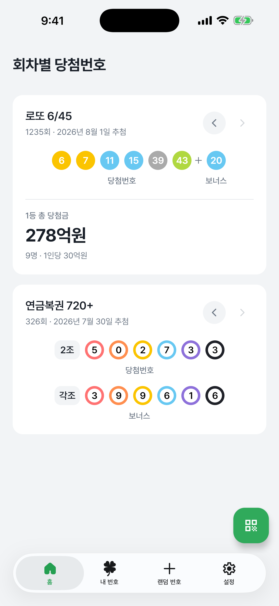 | 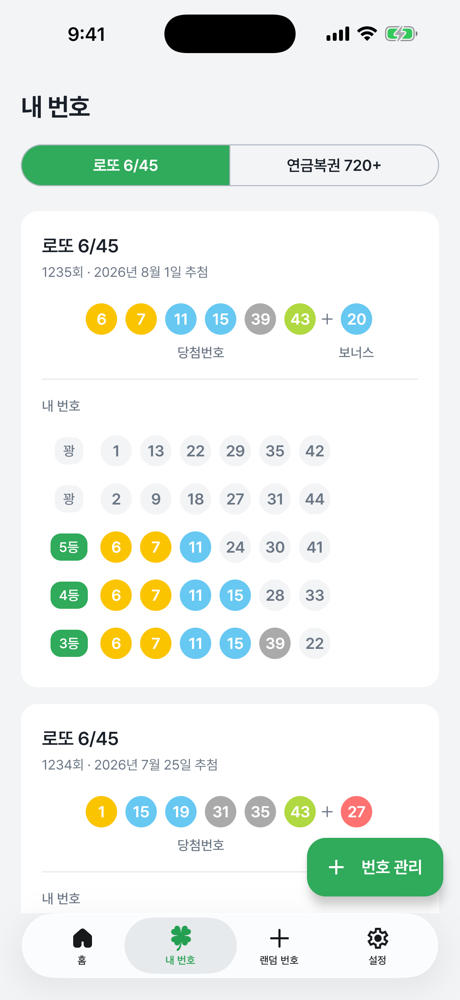 | 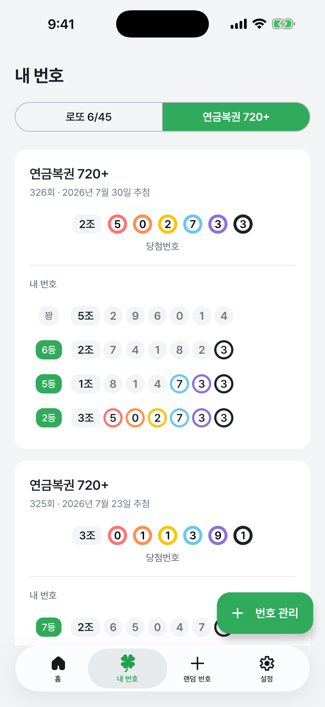 |

| 랜덤 번호 | 번호 생성 | 설정 |
|:---:|:---:|:---:|
| 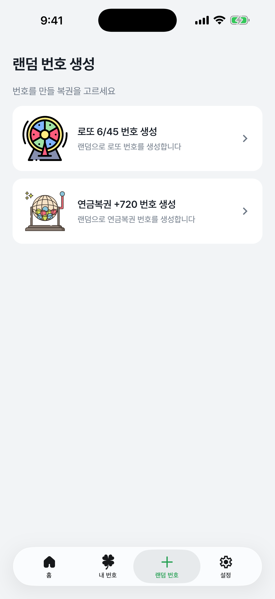 | 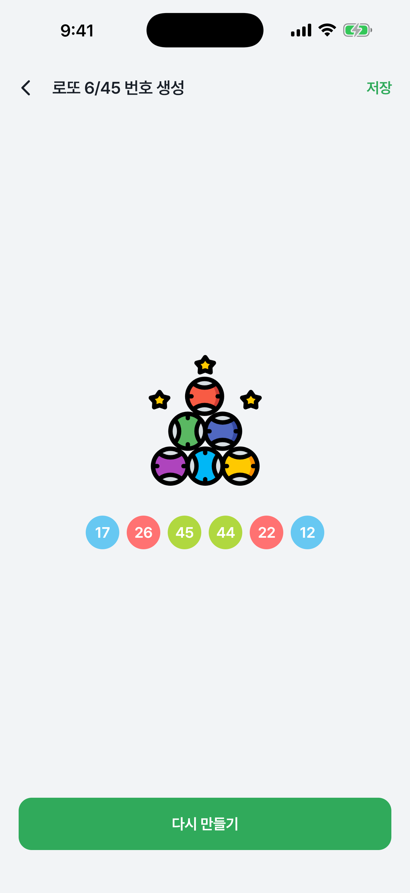 | 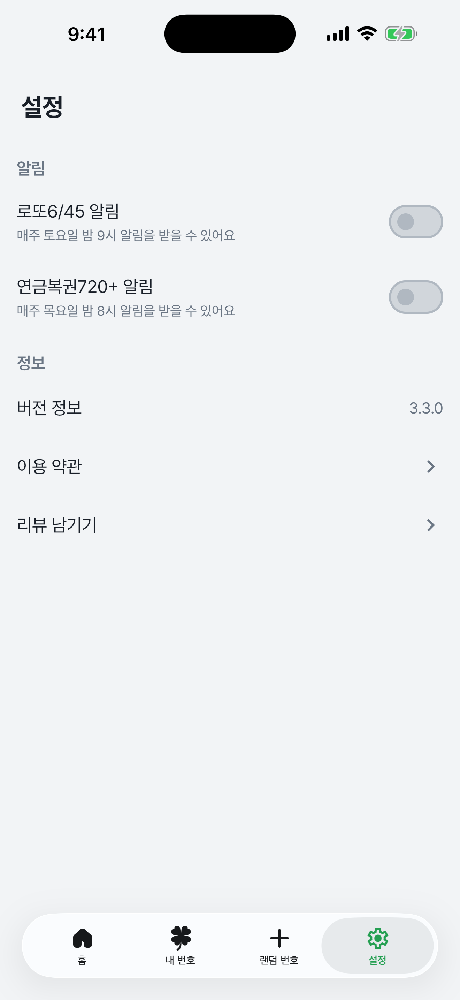 |

<br/>

# Architecture

## MVI + Clean Architecture

```
presentation (feature) → domain → data
         ↓                          ↓
    ViewModel              Repository Implementation
         ↓                          ↓
      UseCase              Local/Remote DataSource
```

### 단방향 데이터 흐름 (Unidirectional Data Flow)

MVI 패턴을 참고한 단방향 데이터 흐름으로 상태 관리의 예측 가능성과 디버깅 용이성을 확보했습니다.

```
User Action (Event)
       ↓
   ViewModel
       ↓              ↘
   UseCase          Effect (일회성 이벤트)
       ↓                    ↓
State 업데이트       UI Side Effect
       ↓            (네비게이션, 스낵바 등)
   UI 재구성
(Recomposition)
```

### Contract 패턴

주요 화면은 `Contract`로 State / Event / Effect를 한곳에 선언합니다.

```kotlin
interface Contract {
    data class State(...)      // UI 상태
    sealed interface Event     // 사용자 액션
    sealed interface Effect    // 일회성 이벤트 (스낵바, 네비게이션 등)
}
```

ViewModel은 `core:ui`의 `BaseViewModel`을 상속해 코루틴 예외 처리를 공유하고,
플랫폼 타입(Activity, UIViewController 등)에 의존하지 않아 그대로 두 플랫폼에서 재사용됩니다.

## 공용 코드 / 플랫폼 코드

Kotlin 소스의 대부분이 `commonMain`에 있습니다. 화면·상태·비즈니스 로직은 전부 공용이고,
플랫폼 코드는 OS API를 감싸는 얇은 어댑터만 남습니다.

| 소스셋 | Kotlin 파일 수 | 내용 |
|---|---|---|
| `commonMain` | 153 (약 76%) | 화면(Compose), ViewModel, UseCase, Repository, DTO/Entity, DI 모듈 |
| `androidMain` | 30 | Activity, ZXing, Tesseract, WorkManager, AdMob, 이미지 크로퍼 |
| `iosMain` | 17 | ComposeUIViewController 팩토리, Swift 브리지 연결, Vision OCR, GMA 배너 |

`core:domain` / `core:data` / `core:remote`는 Android 타깃 없이 `jvm + ios`로 빌드되어
순수 Kotlin 유닛 테스트가 가능합니다.

## 플랫폼 셸

두 플랫폼 모두 화면 자체는 `commonMain`의 Compose 화면을 그대로 쓰고, **바깥 껍데기만 다릅니다.**

**Android** — `composeApp/androidMain`의 단일 `MainActivity`가
공용 `LotteryNavHost`(Compose Multiplatform Navigation)를 띄웁니다.
스플래시 → 메인(4탭) → 번호 생성 / 알림 설정이 하나의 NavGraph로 이어집니다.

**iOS** — `iosApp/iosApp/ContentView.swift`의 SwiftUI 셸이 탭/내비게이션을 담당하고,
각 탭 콘텐츠는 `IosShell.kt`가 노출하는 `ComposeUIViewController` 팩토리를 embed합니다.
Liquid Glass 탭바·내비게이션 바 등 **iOS 네이티브 UI를 그대로 살리기 위한 하이브리드 구성**입니다.
"랜덤 번호"는 Android의 탭 밖 전체화면 라우트와 UX를 맞추려고 `fullScreenCover`로 띄웁니다.

```
Android                              iOS
─────────────────────────────        ─────────────────────────────
MainActivity                         SwiftUI ContentView (TabView)
   └─ LotteryNavHost (공용)             └─ ComposeUIViewController (IosShell.kt)
        └─ HomeScreen ─┐                     └─ HomeScreen ─┐
                       │                                    │
                       └──── commonMain Compose 화면 공유 ───┘
```

## 플랫폼 기능 연결 (expect / actual · Swift Bridge)

OS별 구현이 필요한 기능은 `commonMain`에 `expect` 선언을 두고 플랫폼별 `actual`로 채웁니다.
iOS 네이티브 SDK가 필요한 경우에는 **Swift가 구현하고 Koin에 등록하는 브리지 인터페이스**를 사용합니다.

| 기능 | 공용 선언 | Android | iOS |
|---|---|---|---|
| QR 스캔 | `rememberQrScanAndOpen()` | ZXing (`MainActivity`) | AVFoundation (`QrScannerBridge.swift`) |
| OCR | `OcrService` | Tesseract4Android | Apple Vision (`VNRecognizeTextRequest`) |
| 이미지 선택/크롭 | `rememberLotteryImagePicker()` | vanniktech image-cropper | PHPicker (`PhotoPickerBridge.swift`) |
| 광고 | `PlatformAdBanner` | play-services-ads | Google Mobile Ads SDK (`AdBridge.swift` + `IosAdBridge`) |
| 로컬 알림 예약 | `NotificationScheduler` | WorkManager | `UNUserNotificationCenter` |
| Key-Value 저장소 | `Settings` (multiplatform-settings) | SharedPreferences | `NSUserDefaults` |
| HTTP 엔진 | `platformEngine()` | OkHttp | Darwin |
| 스토어/리뷰/버전 | `rememberSettingActions()` | Intent + Play 스토어 | `SKStoreReviewController` |

> **주의**: `commonMain`에서는 `koinViewModel()`을 쓰지 않고 ViewModel을 파라미터로 주입받습니다.
> Compose Multiplatform 1.10 번들 lifecycle과 별도 lifecycle-viewmodel-compose 버전이 충돌해
> iOS 링크 단계에서 깨지기 때문입니다.

## 모듈 구조

```
lucky-lottery-android-v2
├── composeApp        Android 애플리케이션 + iOS 프레임워크(LuckyLotteryShared)
├── iosApp            Xcode 프로젝트 (SwiftUI 셸 + 네이티브 브리지)
├── core
├── feature
└── build-logic       Gradle Convention Plugins
```

### composeApp

Android `application` 모듈이자 iOS `LuckyLotteryShared` 프레임워크를 만들어내는 단일 진입점입니다.

- `commonMain` — `LotteryNavHost`(공용 네비게이션), Koin 모듈 집계
- `androidMain` — `MainActivity`, `App`(Application), Android DI
- `iosMain` — `IosShell.kt`(화면별 UIViewController 팩토리), `KoinHelper`

### Core Modules

| 모듈 | 설명 | 타깃 |
|---|---|---|
| `core:domain` | 모델, Repository 인터페이스, UseCase | jvm + ios |
| `core:data` | Repository 구현체, DTO/Entity 매퍼 | jvm + ios |
| `core:remote` | Ktor + Ktorfit 기반 동행복권 API 클라이언트 | jvm + ios |
| `core:local` | Room(KMP) DB, multiplatform-settings, 알림 스케줄러 | android + ios |
| `core:ocr` | OCR 추상화 (Tesseract / Vision) | android + ios |
| `core:ui` | 디자인 시스템, 공통 컴포넌트, BaseViewModel, 이미지 로더 | android + ios (Compose) |

### Feature Modules

`feature:splash` · `feature:home` · `feature:mynumber` · `feature:randomnumber` ·
`feature:randomnumbergeneration` · `feature:notification` · `feature:setting`

각 모듈은 Screen / ViewModel / Contract / DI 모듈을 `commonMain`에 두고,
플랫폼 구현이 필요한 부분만 `androidMain` · `iosMain`에 `actual`을 둡니다.

### Build Logic

| Convention Plugin | 용도 | 타깃 |
|---|---|---|
| `junjange.kotlin.multiplatform` | 순수 Kotlin 공용 모듈 | jvm, iosX64/Arm64/SimulatorArm64 |
| `junjange.kotlin.multiplatform.library` | Android 플랫폼 API가 필요한 비-Compose 모듈 | androidTarget + iOS |
| `junjange.compose.multiplatform` | Compose UI 모듈 | androidTarget + iOS |

<br/>

# Tech Stacks

## Language & Build
- **Kotlin 2.2.20 / Kotlin Multiplatform** - Android · iOS 공용 코드
- **Gradle 8.13 (Kotlin DSL)** + **Version Catalog** + **Convention Plugins**

## UI
- **Compose Multiplatform 1.10.1** - Android · iOS 공용 선언형 UI
- **Material 3** - 디자인 시스템
- **Navigation Compose Multiplatform** - 공용 네비게이션 그래프
- **SwiftUI** - iOS 셸(TabView / NavigationStack)
- **Coil 3** - 멀티플랫폼 이미지 로딩

## Asynchronous
- **Coroutines / Flow** - 비동기 처리 및 반응형 스트림

## Dependency Injection
- **Koin 4** (`koin-core`, `koin-compose`) - 멀티플랫폼 DI
- **Koin KSP** - 컴파일 타임 검증, `KoinModulesTest`로 그래프 검증

## Network
- **Ktor 3** - 멀티플랫폼 HTTP 클라이언트 (OkHttp / Darwin 엔진)
- **Ktorfit** - 선언형 API 인터페이스
- **Kotlinx Serialization** - JSON 직렬화

## Local Storage
- **Room (KMP)** + **SQLite Bundled** - 로컬 데이터베이스
- **Multiplatform Settings** - SharedPreferences / NSUserDefaults 추상화

## Platform Native
- **WorkManager** / **UNUserNotificationCenter** - 추첨일 알림 예약
- **ZXing** / **AVFoundation** - QR 스캔
- **Tesseract4Android** / **Apple Vision** - OCR
- **Android Image Cropper** / **PHPicker** - 이미지 선택
- **Google AdMob** - 배너 · 전면 광고 (Android/iOS 각각의 SDK)

<br/>

# Build

- **Android** — Android Studio에서 열고 `:composeApp` 실행 (`./gradlew :composeApp:assembleDebug`).
  `local.properties`에 AdMob 키(`AD_MOB_APP_ID`, `BANNER_AD_UNIT_ID`, `FULL_SCREEN_AD_UNIT_ID`)가 필요합니다.
- **iOS** — `iosApp/iosApp.xcodeproj`를 Xcode에서 열고 실행하면
  `LuckyLotteryShared.framework`가 자동으로 빌드·embed됩니다. 광고 ID는 `Configuration/*.xcconfig`에 있습니다.

<br/>
